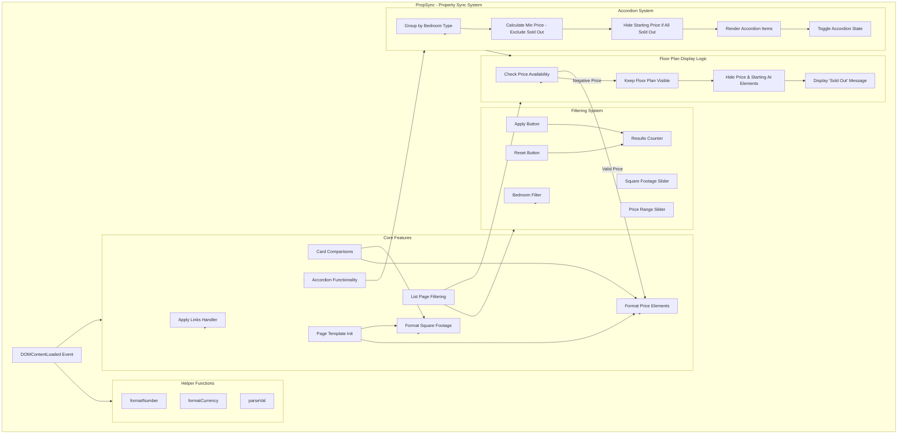

```mermaid
graph TB
    subgraph PropSync["PropSync - Property Sync System"]
        Init[DOMContentLoaded Event]

        subgraph Helpers["Helper Functions"]
            FormatNum[formatNumber]
            FormatCurr[formatCurrency]
            ParseVal[parseVal]
        end

        subgraph Features["Core Features"]
            ApplyLinks[Apply Links Handler]
            FormatPrice[Format Price Elements]
            FormatSqr[Format Square Footage]
            PageTemplate[Page Template Init]
            ListFilter[List Page Filtering]
            Accordion[Accordion Functionality]
            CardComp[Card Comparisons]
        end

        subgraph FloorPlan["Floor Plan Display Logic"]
            CheckAvail[Check Price Availability]
            KeepVisible[Keep Floor Plan Visible]
            ShowSoldOut[Display 'Sold Out' Message]
            HidePriceEls[Hide Price & Starting At Elements]
        end

        subgraph FilterSystem["Filtering System"]
            BedroomFilter[Bedroom Filter]
            PriceSlider[Price Range Slider]
            SqrSlider[Square Footage Slider]
            ApplyBtn[Apply Button]
            ResetBtn[Reset Button]
            ResultCount[Results Counter]
        end

        subgraph AccordionSys["Accordion System"]
            GroupCards[Group by Bedroom Type]
            CalcMinPrice[Calculate Min Price - Exclude Sold Out]
            RenderAccordion[Render Accordion Items]
            ToggleAccordion[Toggle Accordion State]
            HideStartingPrice[Hide Starting Price if All Sold Out]
        end
    end

    Init --> Helpers
    Init --> Features

    Features --> ApplyLinks
    Features --> FormatPrice
    Features --> FormatSqr
    Features --> PageTemplate
    Features --> ListFilter
    Features --> Accordion
    Features --> CardComp

    ListFilter --> FilterSystem
    ListFilter --> FloorPlan

    FloorPlan --> CheckAvail
    CheckAvail -->|Negative Price| KeepVisible
    KeepVisible --> HidePriceEls
    HidePriceEls --> ShowSoldOut
    CheckAvail -->|Valid Price| FormatPrice

    FilterSystem --> BedroomFilter
    FilterSystem --> PriceSlider
    FilterSystem --> SqrSlider
    ApplyBtn --> ResultCount
    ResetBtn --> ResultCount

    Accordion --> AccordionSys
    AccordionSys --> GroupCards
    GroupCards --> CalcMinPrice
    CalcMinPrice --> HideStartingPrice
    HideStartingPrice --> RenderAccordion
    RenderAccordion --> ToggleAccordion
    AccordionSys --> FloorPlan

    PageTemplate --> FormatPrice
    PageTemplate --> FormatSqr
    CardComp --> FormatPrice
    CardComp --> FormatSqr
```

